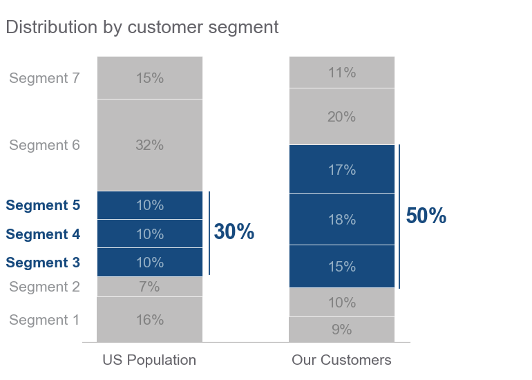
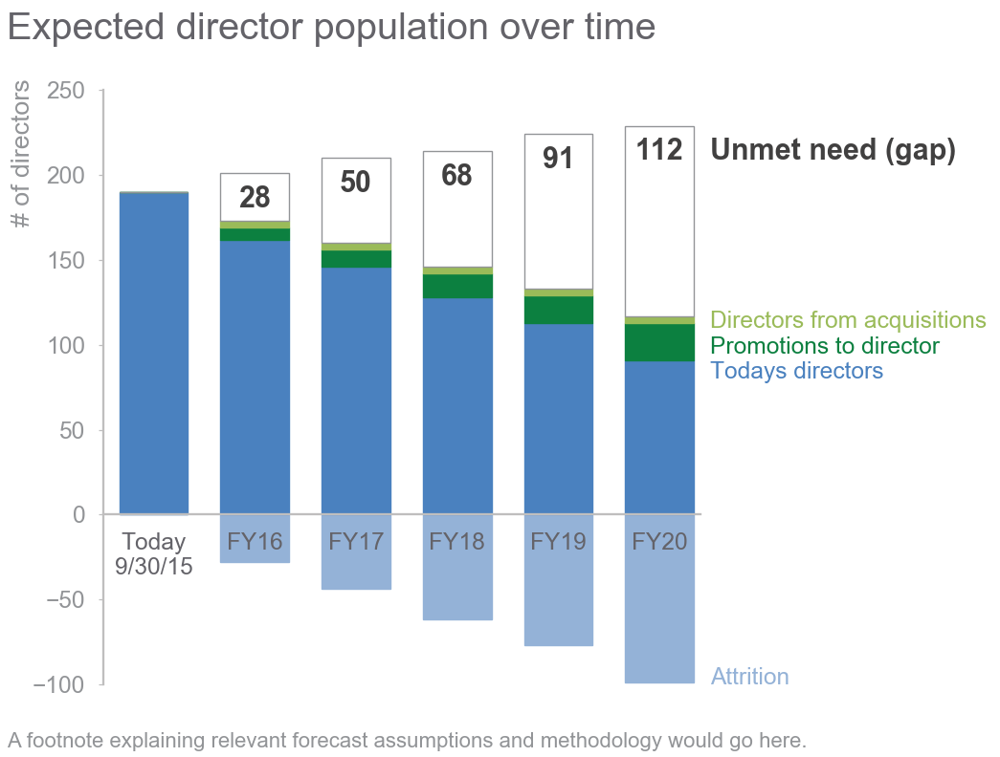
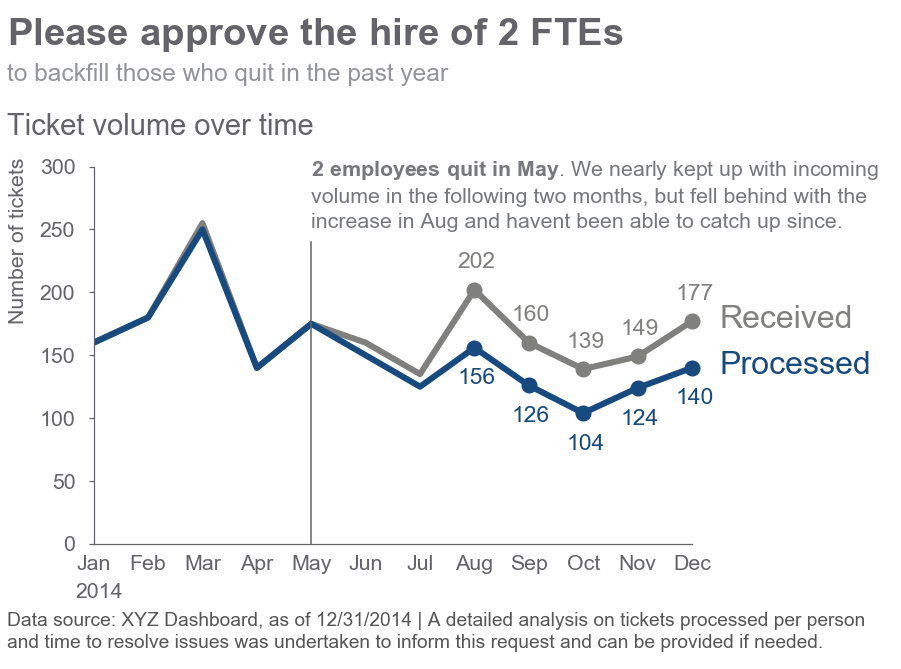

# storytelling-with-data

 
## Vertical & Horizontal Bars
[Figure 0.5](vertical-bar/figure-0-5.ipynb)  |[Figure 3.34](horizontal-bar/figure-3-14.ipynb)
:-------------------------------------------:|:------------------------------------------------:
                   |
[Figure 4.9](horizontal-bar/figure-4-9.ipynb)|[Figure 5.13](vertical-bar/figure-5-13.ipynb)
                   |
[Figure 6.4](vertical-bar/figure-6-4.ipynb)  |
                   |

## Slopegraphs
[Figure 9.32](slopegraph/figure-9-32.ipynb)|
:-----------------------------------------:|
                |

## Simple Texts
[Figure 9.29](simple-text/figure-9-29.ipynb)|
:------------------------------------------:|
                 |

## Scatterplots
[Figure 5.6](scatterplot/figure-5-6.ipynb)|
:----------------------------------------:|
               |

## Lines
[Figure 5.10](line/figure-5-10.ipynb)|
:-----------------------------------:|
          |

# Colors 
## Gray
|#231F20  GRAY1. Thunder         |#414040  GRAY2. Tundora          |#555655  GRAY3. Nandor           |#646369  GRAY4. Mid Gray         |#76787B  GRAY5. Rolling Stone    |#828282  GRAY. Gray              |#929497  GRAY7. Oslo Gray        |#A6A6A5  GRAY8. Delta            |#BFBEBE  GRAY9. Silver           |
:-------------------------------:|:-------------------------------:|:-------------------------------:|:-------------------------------:|:-------------------------------:|:-------------------------------:|:-------------------------------:|:-------------------------------:|:-------------------------------:|
|||||||||

## Blue
|#174A7E  BLUE1. Chathams Blue   |#4A81BF  BLUE2. Steel Blue       |#94B2D7  BLUE3. Polo Blue        |#94AFC5  BLUE4. Nepal            |                                  |                                  |                                  |                                  |                                  |
:-------------------------------:|:-------------------------------:|:-------------------------------:|:-------------------------------:|:--------------------------------:|:--------------------------------:|:--------------------------------:|:--------------------------------:|:--------------------------------:|
|||||||||

## RED
|#C3514E  RED1. Fuzzy Wuzzy Brown|#E6BAB7  RED2. Rose Fog          |                                  |                                  |                                  |                                  |                                  |                                  |                                  |
:-------------------------------:|:-------------------------------:|:--------------------------------:|:--------------------------------:|:--------------------------------:|:--------------------------------:|:--------------------------------:|:--------------------------------:|:--------------------------------:|
  |  ||||||||

## GREEN
|#0C8040  GREEN1. Salem            |#9ABB59  GREEN2. Celery            |                                  |                                  |                                  |                                  |                                  |                                  |                                  |
:---------------------------------:|:---------------------------------:|:--------------------------------:|:--------------------------------:|:--------------------------------:|:--------------------------------:|:--------------------------------:|:--------------------------------:|:--------------------------------:|
|||||||||

## ORANGE
|#F79747  ORANGE1. Tan Hide          |                                  |                                  |                                  |                                  |                                  |                                  |                                  |                                  |
:-----------------------------------:|:--------------------------------:|:--------------------------------:|:--------------------------------:|:--------------------------------:|:--------------------------------:|:--------------------------------:|:--------------------------------:|:--------------------------------:|
|||||||||
