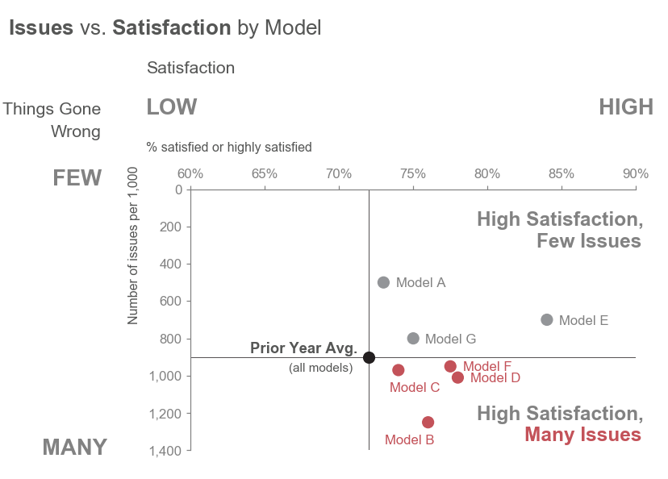

# storytelling-with-data

 
## Vertical & Horizontal Bars
[Figure 0.5](vertical-bar/figure-0-5.ipynb)  |[Figure 3.34](horizontal-bar/figure-3-14.ipynb)
:-------------------------------------------:|:------------------------------------------------:
                   |
[Figure 4.9](horizontal-bar/figure-4-9.ipynb)|
                   |

## Slopegraphs
[Figure 9.32](slopegraph/figure-9-32.ipynb)|&nbsp;
:-----------------------------------------:|:-------------------------:
                |&nbsp; 

## Simple Texts
[Figure 9.29](simple-text/figure-9-29.ipynb)|&nbsp;
:------------------------------------------:|:-------------------------:
                 |&nbsp;

## Scatterplots
[Figure 5.6](scatterplot/figure-5-6.ipynb)|&nbsp;
:----------------------------------------:|:-------------------------:
               |&nbsp;
